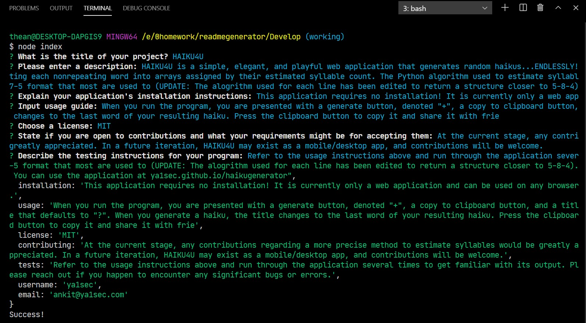

# Good README Generator

[](https://opensource.org/licenses/MIT)

This is a CLI application that dynamically generates a professional README.md from a user's input using the Inquirer package. A command-line application allows for quick and easy functionality, and allows a project creator to spend more time working on finishing the project and less time creating a good README.

## User Story

```
AS A developer
I WANT a README generator
SO THAT can quickly create a professional README for a new project
```

## Application Functionality

```md
GIVEN a command-line application that accepts user input
WHEN I am prompted for information about my application repository
THEN a quality, professional README.md is generated with the title of your project and sections entitled Description, Table of Contents, Installation, Usage, License, Contributing, Tests, and Questions
WHEN I enter my project title
THEN this is displayed as the title of the README
WHEN I enter a description, installation instructions, usage information, contribution guidelines, and test instructions
THEN this information is added to the sections of the README entitled Description, Installation, Usage, Contributing, and Tests
WHEN I choose a license for my application from a list of options
THEN a badge for that license is added hear the top of the README and a notice is added to the section of the README entitled License that explains which license the application is covered under
WHEN I enter my GitHub username
THEN this is added to the section of the README entitled Questions, with a link to my GitHub profile
WHEN I enter my email address
THEN this is added to the section of the README entitled Questions, with instructions on how to reach me with additional questions
WHEN I click on the links in the Table of Contents
THEN I am taken to the corresponding section of the README
```

## Usage & Demos

- The generated README can be found in the [Develop folder](./Develop/README.md)

- A video demonstrating the application's functionality can be found [here](https://drive.google.com/file/d/1HNklS3ahSdILBcgpQbJTiRbl3fCWWTb3/view)


